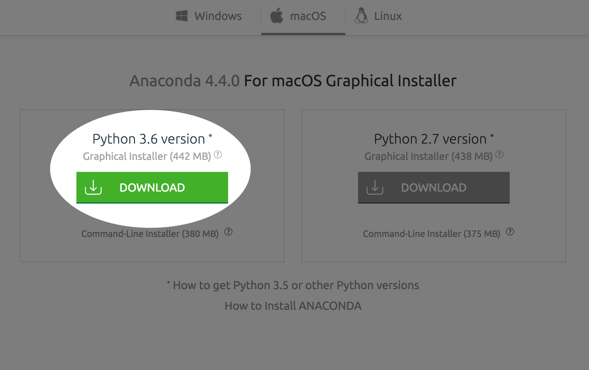

---

layout: default
title: Advanced Statistical Computing

---

# Software

Bios 8366 is taught using Python and the "Scientific Stack", a set of core scientific computing packages written and maintained by various third parties.

## Python

The first step is to install Python on your computer. I will be teaching this course based on **Python 3.5**. If Python 3 is not on your system, you can either download an installer from [Python.org](http://python.org) or install a third-party distribution (see below). I recommend the latter, since these distributions are enhanced, containing most or all of the packages required for the course.

In addition to Python itself, we will be making use of several packages in the scientific stack. These include the following:

* [NumPy](http://www.numpy.org/ "NumPy &mdash; Numpy")
* [SciPy](http://www.scipy.org/ "SciPy.org &mdash; SciPy.org")
* [IPython](http://ipython.org/ "Announcements &mdash; IPython")
* [Pandas](http://pandas.pydata.org/ "Python Data Analysis Library &mdash; pandas: Python Data Analysis Library")
* [Matplotlib](http://matplotlib.org/ "matplotlib: python plotting &mdash; Matplotlib 1.2.1 documentation")
* [PyMC](https://github.com/pymc-devs/pymc "pymc-devs/pymc · GitHub")
* [scikit-learn](http://scikit-learn.org/ "scikit-learn: machine learning in Python &mdash; scikit-learn 0.13.1 documentation")

If your Python distribution does not include these packages, you can install them using either `pip` or `easy_install`.

### All-in-one Scientific Python

Perhaps the easiest way to get a feature-complete version of Python on your system is to install the [Anaconda](http://continuum.io/downloads.html) distribution by Continuum Analytics. Anaconda is a completely free Python environment that includes includes almost 200 of the best Python packages for science and data analysis. Its simply a matter of downloading the installer (either graphical or command line), and running it on your system.

Be sure to download the Python 3.5 installer, by following the **Python 3.5 link**

Once Anaconda is installed, additional packages may be added to your installation via the `conda` utility. For example, to install SymPy one simply has to run:

    conda install sympy
    
from the terminal. It, along with all its dependencies, will be installed from binaries that have been built and checked by Continuum Analytics.

### Mac OS X

Since OS X ships with Python pre-installed, it is often inconvenient to install another Python distribution. For users running the latest version of OS X, I build and maintain the [Scipy Superpack](http://fonnesbeck.github.io/ScipySuperpack/) which are recent builds of fundamental Python scientific computing packages for OS X. The installer is a simple shell script that will install recent 64-bit builds of Numpy,  Scipy, Matplotlib, IPython, Pandas, Statsmodels, Scikit-Learn and PyMC.

## Git

The use of version control systems is essential for effective scientific computing. In Bios 8366, we [make extensive use of Git](http://fonnesbeck.github.io/Bios8366/git.html), which is one of several widely-used versioning systems.

To install Git, you can either download an installer from [the Git website](http://git-scm.com), or if you are on a UNIX-based computer, install it via your system's package manager (recommended). On Mac OS X, you can easily install a variety of software packages using [Homebrew](http://mxcl.github.io/homebrew/ "Homebrew — MacPorts driving you to drink? Try Homebrew!"). To obtain Git, simply type:

    brew install git

On Linux, you can issue a similar command with `apt-get` or `yum`, depending on which Linux distribution you are using.

In addition to installing Git locally, we will be using [GitHub](https://github.com/ "GitHub · Build software better, together.") to remotely store and share our code and documents. If you do not already have a GitHub account of your own, you can [request an educational account](https://github.com/edu) that will allow you to create private repositories that you can use for your course work.

## Document Preparation Tools

For preparing assignments and final projects, students may select from a variety of document preparation tools. Each of these facilitate scientific reporting by being able to embed code and typeset mathematical equations.

* [IPython Notebook](http://ipython.org/notebook.html "The IPython Notebook &mdash; IPython") A web-based interactive computational environment where you can combine code execution, text, mathematics, plots and rich media into a single document (recommended format)
* [LaTeX](http://www.latex-project.org) A scientific document preparation system.
* [pweave](http://mpastell.com/pweave/ "About Pweave &mdash; Pweave - reports from data with Python") A tool for embedding Python code and output in LaTeX, analogous to Sweave.
* [Pandoc](http://johnmacfarlane.net/pandoc/ "Pandoc - About pandoc") A tool for converting among markup formats.
* [Multimarkdown](http://fletcherpenney.net/multimarkdown/ "MultiMarkdown") An enhanced version of Markdown.
* [reStructuredText](http://docutils.sourceforge.net/rst.html "reStructuredText") An easy-to-read, what-you-see-is-what-you-get plaintext markup syntax and parser system

***The use of traditional word processing software, such as Microsoft Word or OpenOffice is not permitted in Bios 8366.***
